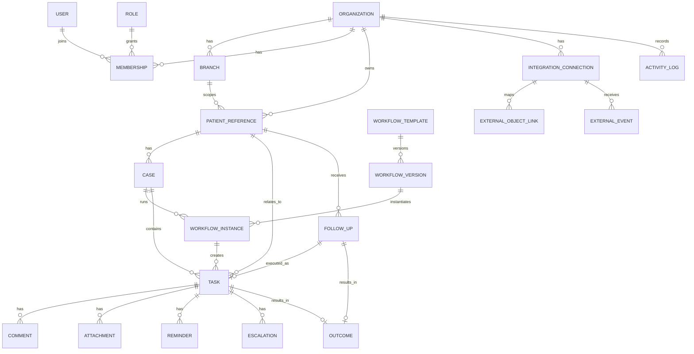

# مدل داده دامنه — Healthcare Clinics Domain Data Model

> وضعیت سند: Domain Model v1  
> هدف: تعریف مدل داده‌ای یکپارچه برای **Patient Record + System of Action** کلینیک؛ به‌طوری‌که TaskMG بتواند اطلاعات بیمار و داده‌های clinical/operational را نگهداری و workflowهای مرتبط را اجرا کند.  
> اصل: **Patient record + operational execution, permission-aware, audited, tenant-safe by default.**

---

# 1. اهداف مدل داده

مدل باید بتواند این سؤال‌ها را پاسخ دهد:

- این task متعلق به کدام کلینیک و شعبه است؟
- برای کدام patient/case است؟
- owner کیست؟
- due چه زمانی است؟
- outcome چیست؟
- next action چیست؟
- workflow در چه مرحله‌ای است؟
- چه کسی چه تغییری داده؟
- data از کدام سیستم خارجی آمده؟
- آیا user حق دیدن آن را دارد؟

---

# 2. اصول معماری داده

## Principle 1 — Tenant First

تقریباً تمام domain objectها باید tenant/clinic scope داشته باشند.

## Principle 2 — Operational Patient Reference

Patient object برای workflow است، نه پرونده بالینی جامع.

## Principle 3 — Case for Multi-step Work

Taskهای مرتبط با یک journey باید بتوانند زیر Case قرار بگیرند.

## Principle 4 — Status and Outcome Are Different

Status:
کار در چه مرحله اجرایی است؟

Outcome:
نتیجه business action چه بود؟

## Principle 5 — Next Action Is First-Class

Next Action نباید فقط متن داخل comment باشد.

## Principle 6 — Audit Is Append-only

تغییرات مهم باید event تاریخی داشته باشند.

## Principle 7 — External IDs Are References

شناسه خارجی جای شناسه داخلی را نمی‌گیرد.

## Principle 8 — Data Minimization

اطلاعاتی که برای workflow لازم نیست، ذخیره نشود.

---

# 3. Entity Map

Core entities:

- Organization / Clinic
- Branch
- Staff / User
- Role
- Membership
- PatientReference
- Lead
- AppointmentReference
- ServiceReference
- Case
- WorkflowTemplate
- WorkflowVersion
- WorkflowInstance
- Task / Action
- FollowUp
- Outcome
- Reminder
- Escalation
- Comment
- Attachment
- Tag
- Category
- Notification
- ActivityLog
- IntegrationConnection
- ExternalObjectLink
- ExternalEvent

---

# 4. Relationship Map

---

# 5. Organization / Clinic

نماینده tenant اصلی.

## Fields

- id
- public_id
- name
- slug
- status
- timezone
- locale
- default_language
- created_at
- updated_at

## Optional

- legal_name
- settings
- branding
- data_retention_policy_id

## Rules

- همه branchها زیر Organization هستند.
- user می‌تواند در چند Organization membership داشته باشد.
- query بدون organization scope در domain layer مجاز نباشد.

---

# 6. Branch

نماینده مکان/واحد عملیاتی.

## Fields

- id
- organization_id
- name
- code
- timezone override optional
- status
- address_reference optional
- created_at

## Rules

- branch همیشه organization-owned است.
- data branch-specific باید organization_id نیز داشته باشد.
- branch delete ترجیحاً soft-delete/archive.

---

# 7. User / Staff

User هویت authentication است.

## Fields

- id
- telegram_user_id optional
- email optional
- phone optional
- display_name
- status
- created_at
- last_active_at

## Important

User به‌تنهایی tenant role ندارد.

Role از Membership می‌آید.

---

# 8. Role

Role تعریف permission set است.

## Standard Roles

- owner
- manager
- doctor
- reception
- coordinator
- assistant
- admin

## Fields

- id
- organization_id nullable for system role
- key
- name
- permissions
- is_system
- created_at

## Permission Examples

- patients.view
- patients.manage
- tasks.view
- tasks.create
- tasks.assign
- cases.view
- reports.view
- users.manage
- integrations.manage

---

# 9. Membership

رابط User با Organization/Branch.

## Fields

- id
- organization_id
- user_id
- role_id
- branch_id nullable
- status
- joined_at
- ended_at

## Rules

- یک user می‌تواند چند membership داشته باشد.
- branch_id null می‌تواند organization-wide scope باشد، فقط اگر role اجازه دهد.
- authorization از Membership derive شود.

---

# 10. PatientReference

Operational reference بیمار.

## Fields

- id
- organization_id
- branch_id
- external_reference optional
- display_name
- phone optional/encrypted or protected as required
- email optional
- primary_doctor_user_id optional
- status
- created_at
- updated_at

## Optional Metadata

- preferred_contact_channel
- operational_tags
- source

## Patient Record Scope

Patient Record می‌تواند شامل این داده‌ها باشد و باید به‌صورت schema/migration-safe توسعه یابد:
- demographics and identity
- contact information
- allergies
- chronic conditions
- medications
- diagnoses
- medical/clinical history
- clinical notes
- treatment-related information
- documents and attachments
- imaging metadata/files where enabled
- external PMS/EMR references
- operational history

## Rules

- organization-scoped unique external_reference when present.
- duplicate detection needed.
- patient delete policy must consider audit and retention.

---

# 11. Lead

Lead زمانی مفید است که person هنوز patient operational record کامل نیست.

## Fields

- id
- organization_id
- branch_id
- display_name
- contact_reference
- source
- service_interest
- owner_user_id
- status
- next_action_at
- converted_patient_id nullable
- created_at

## Status

- New
- Contacted
- Consultation Scheduled
- Qualified
- Converted
- Lost

## Priority

P1/P2 برای Dental، مهم‌تر برای Beauty.

---

# 12. AppointmentReference

TaskMG scheduler کامل نیست؛ AppointmentReference لینک operational است.

## Fields

- id
- organization_id
- branch_id
- patient_id
- doctor_user_id optional
- external_provider optional
- external_appointment_id optional
- start_at
- end_at
- status
- source
- updated_at

## Status

- Scheduled
- Confirmed
- Cancelled
- No-show
- Completed

## Rules

اگر external calendar/PMS source of truth است، زمان appointment از آن sync شود.

---

# 13. ServiceReference / TreatmentReference

برای category عملیاتی service.

## Fields

- id
- organization_id
- code
- name
- category
- active

## Examples

- Implant
- Prosthetic
- Orthodontic
- General Callback
- Physiotherapy Course

## Boundary

این object clinical treatment plan نیست؛ فقط classification عملیاتی است.

---

# 14. Case

Case container برای workflow چندمرحله‌ای است.

## Fields

- id
- organization_id
- branch_id
- patient_id
- case_type
- title
- primary_doctor_user_id optional
- owner_user_id
- status
- current_stage
- workflow_instance_id optional
- next_action_task_id optional
- opened_at
- closed_at
- created_by
- created_at
- updated_at

## Status

- Active
- Waiting
- Blocked
- Completed
- Closed
- Cancelled

## Examples

- Implant Case
- Lab Case
- Complaint Case
- Treatment Follow-up Case

## Rules

Active Case بدون next action باید قابل flag باشد.

---

# 15. WorkflowTemplate

تعریف منطقی workflow.

## Fields

- id
- organization_id nullable for system template
- key
- name
- vertical
- description
- status
- current_version_id
- created_by
- created_at

## Examples

- dental.treatment_followup
- dental.lab_case
- clinic.daily_opening

---

# 16. WorkflowVersion

Template باید versioned باشد تا تغییر process، instanceهای قبلی را خراب نکند.

## Fields

- id
- workflow_template_id
- version_number
- definition_json
- published_at
- published_by
- status

## Definition Includes

- stages
- allowed transitions
- default owners
- due rules
- outcomes
- automations
- escalation
- required fields

---

# 17. WorkflowInstance

اجرای یک version مشخص.

## Fields

- id
- organization_id
- branch_id
- workflow_version_id
- patient_id optional
- case_id optional
- current_stage
- status
- started_at
- completed_at
- created_by

## Rule

Instance همیشه version را pin کند.

---

# 18. Task / Action

واحد اصلی execution.

## Fields

### Identity
- id
- public_id
- organization_id
- branch_id

### Context
- patient_id optional
- case_id optional
- workflow_instance_id optional
- appointment_reference_id optional

### Work
- title
- description optional
- category_id optional
- priority
- status
- owner_user_id
- assigned_by_user_id
- created_by_user_id

### Time
- due_at
- started_at
- completed_at
- cancelled_at
- created_at
- updated_at

### Outcome
- outcome_id optional

### Control
- source_type
- source_reference
- parent_task_id optional
- blocked_reason optional

## Priority

- Critical
- High
- Normal
- Low

## Status

- New
- Assigned
- In Progress
- Waiting
- Blocked
- Completed
- Cancelled

---

# 19. FollowUp

FollowUp business concept مستقل است؛ ممکن است توسط Task اجرا شود.

## Fields

- id
- organization_id
- branch_id
- patient_id
- case_id optional
- task_id optional
- followup_type
- owner_user_id
- due_at
- attempt_number
- status
- outcome_id optional
- rescheduled_to optional
- completed_at
- created_at

## Status

- Due
- In Progress
- Rescheduled
- Completed
- Closed

## Types

- Treatment Plan
- Callback
- Post-Treatment
- Recall
- No-show Recovery
- Complaint Follow-up

---

# 20. Outcome

Outcome یک business result structured است.

## Fields

- id
- organization_id
- workflow_template_id optional
- key
- label
- category
- is_terminal
- requires_next_action
- active

## Examples

- reached
- no_answer
- scheduled
- declined
- needs_time
- escalated
- resolved
- rework

## Rule

Outcome نباید فقط free text باشد.

Comment می‌تواند context تکمیلی باشد.

---

# 21. Next Action

دو الگو ممکن است:

## Preferred Model

Next Action همان Task بعدی است و Case.next_action_task_id به آن اشاره می‌کند.

مزیت:
- duplication کمتر
- task engine reuse

## Optional Derived Fields

در Case برای query سریع:

- next_action_due_at
- next_action_owner_user_id
- next_action_type

این fields باید derived/cache باشند یا consistency rule داشته باشند.

---

# 22. Reminder

## Fields

- id
- organization_id
- task_id
- user_id
- remind_at
- channel
- status
- sent_at
- dedupe_key
- created_at

## Status

- Pending
- Sent
- Cancelled
- Failed

## Rules

- completed task reminder cancel
- unique dedupe_key
- retry-safe

---

# 23. Escalation

## Fields

- id
- organization_id
- task_id
- level
- triggered_at
- target_user_id optional
- target_role_id optional
- reason
- status
- acknowledged_at

## Levels

- 0 Owner Reminder
- 1 Lead
- 2 Manager
- 3 Critical

---

# 24. Comment

## Fields

- id
- organization_id
- task_id optional
- case_id optional
- author_user_id
- body
- visibility
- created_at
- edited_at

## Visibility

- Internal
- Restricted
- System

Patient-facing comment should be a separate communication concept if introduced later.

---

# 25. Attachment

## Fields

- id
- organization_id
- task_id optional
- case_id optional
- comment_id optional
- uploaded_by
- storage_key
- filename
- mime_type
- size
- checksum
- created_at
- deleted_at

## Rules

- permission inherited from parent
- secure download
- retention
- malware/file validation strategy

---

# 26. Tag

## Fields

- id
- organization_id
- name
- type optional
- active

Join tables:

- patient_tag
- task_tag
- case_tag

## Rule

tagهای مهم business نباید جای field ساختاریافته را بگیرند.

---

# 27. Category

## Fields

- id
- organization_id
- domain
- key
- name
- active

Domains:

- task
- case
- service

---

# 28. Notification

## Fields

- id
- organization_id
- user_id
- event_type
- entity_type
- entity_id
- channel
- payload_reference
- status
- scheduled_at
- sent_at
- read_at

## Channels

- Telegram
- Web
- Email future
- SMS future
- WhatsApp future

---

# 29. ActivityLog

Append-only audit/event history.

## Fields

- id
- organization_id
- branch_id optional
- actor_user_id optional
- actor_type
- action
- entity_type
- entity_id
- before_snapshot optional/minimized
- after_snapshot optional/minimized
- metadata
- request_id
- created_at

## Examples

- task.created
- task.assigned
- task.completed
- followup.outcome_changed
- case.stage_changed
- user.role_changed
- export.created

## Rule

Audit log permission جدا داشته باشد.

---

# 30. IntegrationConnection

## Fields

- id
- organization_id
- provider
- account_reference
- auth_type
- encrypted_secret_reference
- scopes
- status
- expires_at
- last_sync_at
- created_by
- created_at

---

# 31. ExternalObjectLink

Map بین object خارجی و داخلی.

## Fields

- id
- organization_id
- integration_connection_id
- provider_object_type
- external_id
- internal_entity_type
- internal_entity_id
- sync_direction
- last_synced_at
- version/etag optional

## Unique

(provider connection, object type, external ID)

---

# 32. ExternalEvent

## Fields

- id
- organization_id
- integration_connection_id
- external_event_id
- event_type
- resource_type
- resource_id
- received_at
- processed_at
- status
- retry_count
- payload_reference/minimized

## Unique

integration_connection_id + external_event_id

برای idempotency.

---

# 33. Relationship Rules

## Patient → Case

One-to-many.

## Case → Tasks

One-to-many.

## WorkflowInstance → Tasks

One-to-many.

## Task → Outcome

Zero-or-one active final outcome؛ history در ActivityLog.

## FollowUp → Task

یک FollowUp می‌تواند توسط یک Task اجرا شود.

## Task → Reminder

One-to-many.

---

# 34. Tenant Isolation

هر query روی tenant-scoped object باید organization_id داشته باشد.

## Unsafe

get task by task_id only.

## Safe

get task by:
- organization_id
- task_id
- permission scope

## Test

User A از Clinic A نباید entity Clinic B را حتی با ID معتبر بخواند.

---

# 35. Branch Scope

branch scope بعد از tenant scope اعمال شود.

مثال:

Reception:
branch only.

Owner:
organization-wide.

Doctor:
related patient/case + branch policy.

---

# 36. Source of Truth

| Data | Source of Truth |
|---|---|
| Task status | TaskMG |
| Follow-up outcome | TaskMG |
| Case next action | TaskMG |
| Patient clinical record | TaskMG Healthcare؛ با امکان sync/reference به PMS/EMR |
| Appointment time when integrated | PMS/Calendar |
| Payment transaction | Payment provider |
| External lab status if integrated | Lab system |

---

# 37. Data Classification

## Class A — Operational Low Sensitivity

- workflow key
- template
- generic category

## Class B — Internal Business

- staff assignment
- workload
- reports

## Class C — Personal/Sensitive

- patient identity/contact
- appointment relationship
- patient-linked task

## Class D — Clinical/Highly Sensitive

برای داده بالینی ذخیره‌شده از جمله diagnosis و clinical note باید permission، audit، retention و export controls جداگانه اعمال شود.
- medical document

MVP باید Class D را حداقل نگه دارد.

---

# 38. Soft Delete

برای objectهای operational:

- deleted_at
- deleted_by

در بسیاری از موارد soft delete ترجیح دارد تا audit و relationship نشکند.

Hard delete باید retention/privacy policy مشخص داشته باشد.

---

# 39. Data Retention

Retention باید configurable/policy-driven باشد.

Categories:

- operational active
- closed case
- audit
- attachment
- integration raw event

Raw integration payload معمولاً نباید بی‌نهایت نگه داشته شود.

---

# 40. Identifier Strategy

## Internal ID

UUID یا database identifier.

## Public ID

شناسه غیرقابل حدس برای URL/API بهتر است.

## External ID

provider-specific.

## Human-friendly Code

Optional:
CASE-00123

نباید authorization بر اساس opaque بودن ID باشد.

---

# 41. Time Model

همه timestampهای backend:

- UTC canonical

Organization:
- timezone

Display:
- convert to clinic/user timezone

Recurring rule:
- timezone-aware

---

# 42. State Transition Validation

Status change باید در service/domain layer validate شود.

مثال:

Completed → In Progress

فقط:
reopen permission.

Cancelled → Completed

ممکن است forbidden باشد.

Workflow stage transitions نیز template-driven باشند.

---

# 43. Derived Metrics

از raw operational data derive شوند:

- overdue_count
- completion_rate
- cycle_time
- followup_completion
- no_next_action_count
- workload
- escalation_rate

این metricها ترجیحاً query/materialized aggregate باشند، نه field manually editable.

---

# 44. Index Strategy

Indexهای اولیه:

## Task
- organization_id + status
- organization_id + owner_user_id + due_at
- organization_id + branch_id + due_at
- organization_id + patient_id
- organization_id + case_id

## FollowUp
- organization_id + owner_user_id + due_at + status
- organization_id + patient_id

## Case
- organization_id + status
- organization_id + branch_id + status
- organization_id + next_action_due_at if materialized

## ActivityLog
- organization_id + entity_type + entity_id
- organization_id + created_at

---

# 45. Pagination

تمام collectionهای قابل رشد:

- tasks
- patients
- activity
- comments
- reports detail
- integration events

باید pagination داشته باشند.

Offset برای scale کوچک قابل قبول است؛ cursor pagination برای activity/large streams بهتر است.

---

# 46. Concurrency

برای updateهای حساس:

- optimistic locking/version field
- updated_at checks
- transaction

مثال:

دو manager هم‌زمان task را reassign نکنند بدون conflict awareness.

---

# 47. Idempotency

Createهای external/automation باید idempotency key داشته باشند.

مثال:

post-treatment automation برای یک procedure event نباید دو follow-up ایجاد کند.

---

# 48. Event Model

Domain Eventها:

- TaskCreated
- TaskAssigned
- TaskCompleted
- TaskOverdue
- FollowUpOutcomeRecorded
- CaseOpened
- CaseStageChanged
- CaseNeedsAttention
- WorkflowStarted
- WorkflowCompleted
- ExternalEventReceived

این eventها integration و analytics را ساده می‌کنند.

---

# 49. Workflow Definition Model

definition_json می‌تواند شامل:

- stages
- transitions
- required_fields
- default_role
- due_rule
- outcomes
- next_action_rule
- escalation_rule
- automation

Validation schema version لازم است.

---

# 50. Custom Fields

Custom Fields باید محدود و typed باشند.

Types:

- text
- number
- date
- boolean
- enum
- reference

## Avoid

arbitrary nested JSON برای همه چیز.

زیرا:
- reporting سخت
- validation ضعیف
- migration سخت

---

# 51. Multi-Branch Model

Organization  
→ Branch  
→ Membership

Patient:
organization-level identity + branch association policy.

Case:
branch-owned.

Task:
branch-scoped.

Central manager:
organization membership with broad scope.

---

# 52. Multi-Doctor Model

Patient می‌تواند primary doctor داشته باشد.

Case می‌تواند doctor جدا داشته باشد.

Task owner مستقل است.

این تفکیک ضروری است:

**Doctor Context ≠ Task Owner**

---

# 53. Migration from Current Task Model

Current TaskMG task core قابل reuse است.

Migration path:

## Step 1
Add tenant/branch context consistently.

## Step 2
Add patient_reference relationship.

## Step 3
Add case relationship.

## Step 4
Add structured outcome.

## Step 5
Add next action.

## Step 6
Add workflow instance.

نباید current task system یک‌باره rewrite شود.

---

# 54. Mapping Current Capabilities

## Existing

- task
- assignment
- team
- comment
- attachment
- tags
- categories
- priority
- deadline
- reminders
- reports

## New Domain Layer

- patient_reference
- case
- follow_up
- outcome
- workflow_instance
- branch scope
- external links

---

# 55. API Resource Shape

API بهتر است domain-oriented باشد:

- /organizations
- /branches
- /patients
- /cases
- /tasks
- /followups
- /workflows
- /reports
- /integrations

نه اینکه همه چیز فقط task endpoint باشد.

---

# 56. Export Model

Export باید:

- tenant-scoped
- permission-aware
- field-filtered
- auditable

Patient-sensitive export admin/manager permission جدا داشته باشد.

---

# 57. Search Model

Search result باید scope-aware باشد.

Priority:

1. exact external/internal ID
2. patient name
3. task title
4. case code
5. tags

AI semantic search later.

---

# 58. Reporting Data Model

Operational reports از:

- Task
- FollowUp
- Case
- Outcome
- ActivityLog

derive شوند.

Clinical outcomes وارد reporting MVP نشوند.

---

# 59. Data Integrity Constraints

حداقل constraints:

- task.organization_id required
- task.owner belongs to organization
- patient belongs to same organization
- case.patient belongs same organization
- branch belongs organization
- followup patient/case scope consistent
- external link unique
- workflow instance pinned to version

Application validation + database constraint تا جای ممکن.

---

# 60. Security Invariants

این invariantها نباید شکسته شوند:

1. هیچ entity cross-tenant read نشود.
2. owner خارج از tenant assign نشود.
3. branch-limited user data branch دیگر را نبیند.
4. attachment access parent permission را رعایت کند.
5. AI query permission را دور نزند.
6. export محدود به permission باشد.
7. integration event به tenant اشتباه map نشود.

---

# 61. Audit Invariants

برای تغییرات حساس:

- actor
- entity
- action
- time

همیشه مشخص باشد.

Permission change و export حتماً audit شوند.

---

# 62. Privacy-by-Design Questions

قبل از اضافه‌کردن هر field:

- چرا لازم است؟
- چه کسی می‌بیند؟
- چند وقت نگه می‌داریم؟
- آیا از external system می‌توان reference کرد؟
- آیا report به آن نیاز دارد؟
- آیا حذفش workflow را خراب می‌کند؟

اگر پاسخ روشن نیست، field اضافه نشود.

---

# 63. Domain Model MVP

حداقل objectهای لازم برای Pilot:

1. Organization
2. Branch
3. User
4. Role
5. Membership
6. PatientReference
7. Case
8. Task
9. FollowUp
10. Outcome
11. Reminder
12. Comment
13. WorkflowTemplate
14. WorkflowInstance
15. ActivityLog

Integration objects می‌توانند foundation داشته باشند حتی اگر connectorهای زیاد فعال نباشند.

---

# 64. Domain Model Phase 2

اضافه/تقویت:

- WorkflowVersion
- Escalation
- AppointmentReference
- ExternalObjectLink
- ExternalEvent
- custom fields
- dependencies
- SLA

---

# 65. Domain Model Phase 3+

- multi-branch hierarchy advanced
- lead
- communication thread reference
- consent metadata
- benchmark aggregates
- enterprise integration mapping

---

# 66. Definition of Done برای Data Model

مدل داده زمانی آماده Vertical Pilot است که:

- پنج workflow P0 را بدون field hack پشتیبانی کند؛
- authorization scope واضح باشد؛
- patient/case/task relationship تمیز باشد؛
- outcome structured باشد؛
- next action قابل query باشد؛
- audit کامل باشد؛
- integration mapping قابل اضافه‌شدن باشد؛
- pagination/index strategy مشخص باشد؛
- هیچ نیاز MVP به clinical record replication نداشته باشد.

---

# 67. تصمیم مدل داده فعلی

مرکز مدل داده نباید Patient Record باشد.

مرکز مدل باید این زنجیره باشد:

**Patient Reference → Case → Workflow → Action → Outcome → Next Action**

این مدل با Positioning محصول هم‌راستاست:

**TaskMG اطلاعات پزشکی را مالک نمی‌شود؛ اجرای عملیات را مالک می‌شود.**
